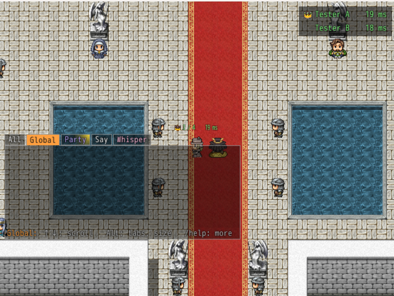

# Monster Girl Quest! Online

*An unofficial multiplayer mod for Monster Girl Quest! Paradox RPG.*

Play Monster Girl Quest! Paradox RPG together with friends over the internet, with nothing to set up in your router.

  
  
  

- **Worlds:** up to 32 players on the same maps, with emotes and an overview of everyone online. A world is *Classic*, where each party plays its own story, or a *Raid World*.
- **Raid Worlds:** the whole world plays one story together. Everyone on a map sees the story's scenes together, party or not, and battles pull in the nearest players, up to four, each with one Frontline and two Backline characters. Stand next to a player in a battle and press **J** to join it. Whoever is furthest pushes the story on for everyone; a player behind sees the world as it was at the end of their part and catches up as they level, and companions join on reaching their level. Story bosses share their HP across the world and take several victories to beat. Raid Worlds are red and at the top of the list.
- **Chat:** global, party, say and whisper chats in tabs, a glow on tabs with unread lines, and speech bubbles over the players on your map.
- **Parties:** up to four players play the leader's story together and share one team's worth of companions.
- **Co-op battles:** party members on the same map join each other's battles, each commanding their own characters.
- **Duels and PvP battles:** your team against a friend's, live, inside a world or outside one.
- **Trading:** swap items, equipment, stones and gold with a player on your map; the relay sees to it that a disconnect never loses or copies anything.

Worlds, parties and co-op battles are a **prototype**, and Raid Worlds are **experimental**: expect bugs, and please [report them](https://github.com/Pauliinchen/MGQ-Online/issues/new?template=bug_report.yml).

## Requirements

- **Monster Girl Quest! Paradox RPG 3.06**, with or without the English translation. Everyone needs the same game version and the same version of this mod. A translated and an untranslated game can play together; each shows battles in its own language.
- **The community's mod loader:** the `Patch.rb` from [*Patch.rb (enable Type 1 mods)*](https://mgq.miraheze.org/wiki/Paradox_mods#Patch.rb_(enable_Type_1_mods)) on the MGQ wiki, in your `Patch` folder.

Optional:

- [Discord Rich Presence](https://github.com/Pauliinchen/MGQ-Paradox-Discord-Rich-Presence) 1.5.1 or later: invite friends through Discord instead of sending a join code, show on your profile who you're playing with, and use your Discord name in worlds. With 1.6.1 or later you also invite friends into your world, password included.
- [Battle Dialogue](https://github.com/Pauliinchen/MGQ-Paradox-Mod-Collection/tree/main/Battle_Dialogue): shows what characters say in boxes at the screen's sides, so nobody waits for another player to press a key.

[Mod Config Remake](https://github.com/Pauliinchen/MGQ-Paradox-Mod-Collection/tree/main/0_ModConfigRemake) comes with the mod as `Patch\0_ModConfigRemake.rb`; it binds other hotkeys and shows which options a world sets. It replaces a copy from the Mod Collection with the same file.

## Install

1. Download `MGQ-Online-<version>.zip` from the [latest release](https://github.com/Pauliinchen/MGQ-Online/releases/latest).
2. Close the game and extract the zip into the folder that contains `Game.exe`.

You then have `Multiplayer.rb` in your `Patch` folder, and next to it a `Multiplayer` folder with the rest of the mod; your name and worlds go there too. The logs go into the `Logs` folder of the game folder.

While the mod is installed, the game keeps running when its window is in the background, so no player holds the others up. A gamepad does nothing meanwhile.

**Update:** when a new release is out, *Multiplayer* on the title screen says so and offers to *update and install*, since everyone needs the same version; until then F11's PvP battles stay off too. The game closes, `Patch\Multiplayer\Update.bat` shows what's new, installs the release and removes files an older version left behind, and the game starts again in the Multiplayer menu. You can also close the game and double-click `Update.bat` yourself. Your name, hotkeys, favourites and worlds are kept.

**Uninstall:** close the game and delete `Multiplayer.rb` and the `Multiplayer` folder in `Patch`. Keep `Patch\Multiplayer\Worlds` if you want to play your worlds again later.

## Quick start

1. Pick **Multiplayer** below *Continue* on the title screen and type the name the others see.
2. One of you picks *Create new world*, gives it a name, picks *Classic* or *Raid* (fixed once created) and, if you like, a password.
3. Everyone confirms on that world and picks *Enter the world*.
4. On the map, stand next to a friend, press **B** and pick *Invite to a party*; they accept in their own wheel. You now play the leader's story together and fight co-op battles. In a Raid World a party only gets the first places in battles, since everyone plays the world's story.

For a PvP battle without a world, press **F11** on the map and host; your friend joins with the join code you send them.

## Hotkeys

| Hotkey | What it does |
|---|---|
| **B** | Action wheel: invite, duel, trade, chat, teleport to the leader |
| **T** | Chat: **/g** everyone, **/p** your party, **/s** your map, **/w** one player, **/help** |
| **E** | Emote wheel |
| **F11** | World overview, or the PvP battle screen outside a world |
| **Y** / **N** | Accept / decline the first invite at the top left |
| **Tab** | Make the party box small or full |
| **J** | Join the battle of a player next to you in a Raid World |

Rebind them in *Mod Config → Monster Girl Quest! Online*.

## Documentation

- [Player guide](docs/GUIDE.md): worlds, parties, co-op battles, duels and PvP battles in full, and [troubleshooting](docs/GUIDE.md#troubleshooting).
- [Developer notes](docs/DEVELOPER.md): building, testing and how the mod works inside.
- [Relay](Relay/README.md): the server the games meet at, and its protocol.

## Disclaimer

Monster Girl Quest! Online is an unofficial fan project. It is not affiliated with or endorsed by Torotoro Resistance, the creators of Monster Girl Quest!, or the English translation team. It contains no game or translation files.
