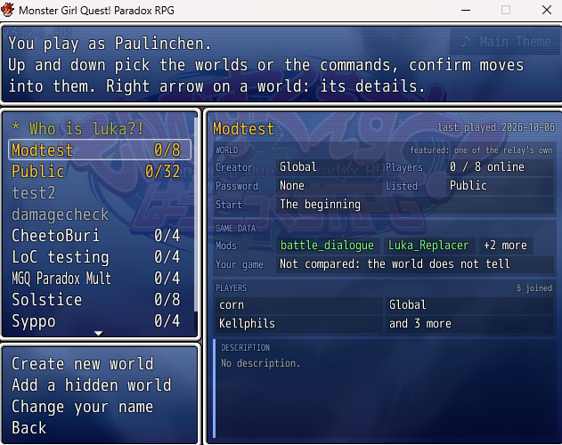
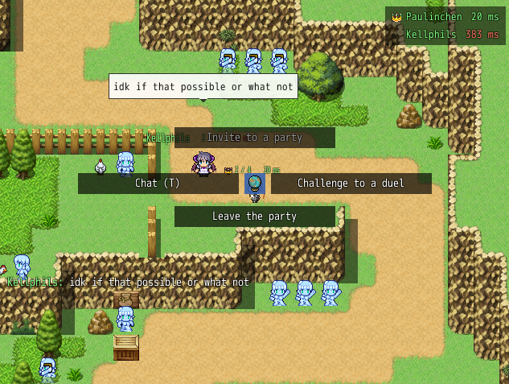
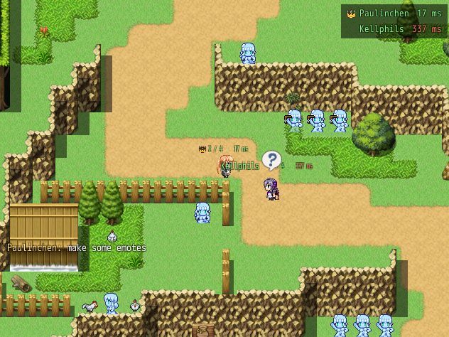
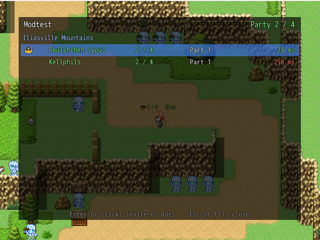
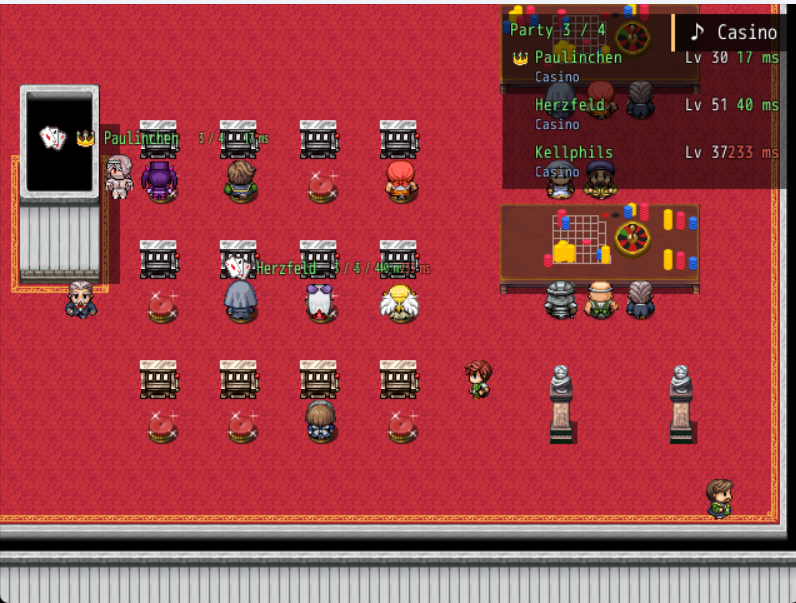
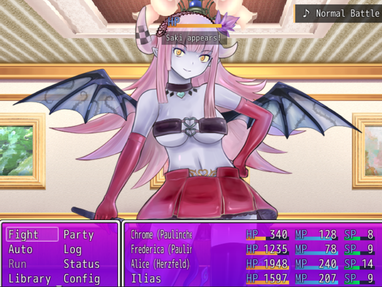

# Player guide

Everything Monster Girl Quest! Online does, for players. To install the mod, see the [README](../README.md).

- [Hotkeys](#hotkeys)
- [Worlds](#worlds)
- [On the map](#on-the-map)
- [Parties](#parties)
- [Co-op battles](#co-op-battles)
- [Duels](#duels)
- [PvP battles](#pvp-battles)
- [Rules of every multiplayer battle](#rules-of-every-multiplayer-battle)
- [Connection and privacy](#connection-and-privacy)
- [Troubleshooting](#troubleshooting)

## Hotkeys

| Hotkey | What it does |
|---|---|
| **B** | Opens the action wheel. |
| **T** | Opens the chat. |
| **E** | Opens the emote wheel. |
| **F11** | Opens the World overview, or the PvP battle screen outside a world. |
| **Y** / **N** | Accepts / declines the first invite in the notification box. |
| **Tab** | Makes the party box small or full. |

This guide names the default hotkeys. To bind others, open *Mod Config → Monster Girl Quest! Online*, confirm the hotkey's row (*Action Wheel*, *Chat*, *World Overview*, *Accept Notification*, *Decline Notification*, *Emote Wheel* or *Party Box Size*) and press the new key; **Esc** keeps the old one.

- Keys the game uses itself can't be bound: the arrows, Enter, Esc, Z, X, Shift, A, S, D, Q and W. Neither can a key another hotkey already uses.
- Your hotkeys are kept in `Patch\Multiplayer\Player.ini`, so they hold in every save and every world, and the texts in the game name the hotkeys you bound.

## Worlds

Pick **Multiplayer** below *Continue* on the title screen. The first time, the game asks for the name the others see, unless the Discord mod knows yours. Names and passwords are typed on the keyboard; with a gamepad, the game's letters appear.

Each world keeps its own saves, Library, medals and affection in `Patch\Multiplayer\Worlds`, so your own game stays untouched. Going back to the title screen leaves the world.

### The world screen

The left side has two boxes: the worlds, and below them the commands (*Create new world*, *Add a hidden world*, *Change your name*, *Back*). Up and down pick a box, confirm moves into it and cancel moves back out, so the commands are reached without scrolling through a long list. Cancel with a box picked leaves the screen.

The worlds box lists every public world, the hidden worlds you joined and the hidden worlds you added by their id, in this order:

1. your favourites, marked `*`;
2. the featured worlds in gold, which the relay's admins run;
3. the ones you played last.

With the cursor on a world, the right side shows its details: who made it, its password and players, how new players start, the mods it needs, whether your game data matches the creator's, and its description. The right arrow moves into the details; up and down pick the mods, *Your game*, the players or the description, and confirm (or a click) opens the full list or text. Every player who ever joined is listed, those online first. The left arrow or cancel goes back to the list.

### Entering a world

Confirm on a world and pick *Enter the world*.

- Type its password the first time, unless it has none; your game remembers it after that.
- You continue from your latest save in that world. The first time, you start at the opening or from the creator's save, or choose where to start if the creator lets you.
- A world is only entered once the list has loaded, since the list tells what the world asks of your game.

### Creating a world

*Create new world* opens a form at the right. Creating a world does not enter it: it appears in the list, marked as a favourite, and you enter it from there.

| Field | What it does |
|---|---|
| Name | What the list shows. |
| Password | Left empty, anyone may enter. |
| Max Players | 2 to 32. |
| Hidden | Leaves the world out of the list. Only its players see it, and whoever adds it by its id. |
| Shared save | Every new player starts from one of your saves, with your party, items, story and Library, instead of the opening. Choose the save after ticking it. |
| Player's choice | Each new player chooses when they first enter: the beginning, one of their own saves, or yours if *Shared save* is ticked. Their own save is copied into the world; the original stays untouched. |
| Mods | The mods of the world, picked from a list of yours. See [Mods of a world](#mods-of-a-world). |
| Allow data mismatch | Unticked at first: a game whose data differs from yours can't enter. Ticked, it is warned and may enter anyway. See [Game data](#game-data). |
| Description | What the world is about, up to 1000 characters. |

The creator can change Max Players, Mods and the Description later with *Edit the world*; everything else is fixed once the world exists.

### Managing worlds

- **Hidden worlds:** the creator copies the id with *Copy the world id* and sends it. The others pick *Add a hidden world* and type or paste it (Ctrl+V); the world then shows in their list. *Remove from my list* takes it off again as long as you never entered it. Your game keeps the 50 worlds you added last.
- **Favourites:** *Mark as a favourite* puts a world at the top of your list.
- **Taking a save home:** *Copy my latest save to my game* on a world you've played, or *Copy to my game* in the menu while you're in it, copies that world's latest save into the first free slot of your own saves. Your own Library, medals and affection stay as they are.
- **Deleting your saves:** *Delete my saves of it* removes your saves of a world from this PC. You'd start anew there, and need its password again.
- **The creator** can remove a player, who can then no longer enter, or delete the world for everyone. The relay's admins can edit and delete any world.

### Mods of a world

*Mods* in the create or edit form opens a list of the mods in your `Patch` folder, all unlisted at first. The mod loader, this mod and Mod Config Remake aren't in it, since every player has them.

- **Enter** or a click on a mod lists or unlists it. *List all your mods* at the top lists every one at once, and then *Unlist all your mods* unlists them again.
- Each mod has two buttons at the right, under the columns *Required* and *Essential*, reached with the right arrow or a click: the red **!** makes it required, the orange **?** essential. A filled button shows how a mod is named; pressing it again makes the mod only listed.

| Mod is | Meaning |
|---|---|
| Listed | Only tells the players; keeps nobody out. |
| Required | A game needs a script `Name.rb` in its `Patch` folder, in the world's version, to enter. Case, spaces, underscores and hyphens don't matter. Shows first: green when you have the world's version, gold when yours is another, red when you don't have it. |
| Essential | For mods that are data files without a script. Keeps nobody out by itself; green while your game data matches the world's, gold otherwise. |

- *Add a mod by name* names a mod you don't have yourself, such as a mod of data files: its row becomes a text box, **Enter** adds the name you typed, **Esc** goes back. Such a mod stays in the list when unlisted; **Del** removes it.
- The mods take 300 characters at most; the top right of the list says when a change would pass that. **Esc** goes back to the form, which shows them as the world keeps them: `!` in front of a required mod, `?` in front of an essential one.

The details show each mod in a box of its own, as many as fit the row, and count the rest in a last box.

**Same version for everyone.** The relay keeps a catalog of mods its admins added, with each one's current version.

- When you enter a world, each required mod is compared with the catalog. If one is missing or another version, the world screen says which and offers *Download and restart*: it fetches the world's version, checks every file, puts it into your `Patch` folder, restarts the game and enters the world. *See the mods* lists your version and the world's.
- A required mod the catalog doesn't know is compared with the creator's copy. If yours differs, get the creator's version from the mod's author; nothing downloads it for you.
- A new version only reaches players the next time they enter.

**The creator's settings.** While the creator plays in their world, they set the options of its mods, required or listed, in the Mod Config Remake menu as they like, then press **Use My Settings for This World** in the menu's *Monster Girl Quest! Online* section. Every player gets those settings the next time they load a save in the world, and the menu shows them greyed out as set by the world. Hotkeys and other personal options stay yours, and your own saves keep your own settings. The relay's admins can see and change a world's settings too.

### Game data

- **What is compared:** which actors, classes, skills, items, weapons, armors, enemies, states, troops, common events and maps exist. A mod that adds or removes any is noticed; a mod that only changes numbers isn't. A translated game still matches the untranslated one.
- **A game that differs:** the world's details say whether your game matches the creator's and, if not, in what. Entering then asks first, or is refused when the creator left *Allow data mismatch* unticked. Worlds made before this check say nothing and take every game.
- **Updating your world's data:** when a mod you play with gets an update, your game no longer matches your own world. Move onto *Your game* in the world's details and confirm, or press *Update current data scan* in *Edit the world*: the world takes your game's data as it is now, and everyone else has to match it again. Only the creator can do this.

## On the map

- **Other players** on your map walk around with their name above them and an icon for what they're doing: fighting, talking or watching an event, typing, in a menu, the inventory or their equipment, shopping, at the casino, in the Library, sailing, flying, or away. They walk through everything and trigger nothing.
- **Ping** shows after each player's name, and yours above your head: green up to 100 ms, yellow up to 200 ms, red beyond.
- **The bottom left** tells who joined and left, and when the connection is being restored. A player whose connection drops stays in the world and in their party for 15 seconds, so a short break changes nothing.
- **The world never pauses.** While you're in a menu, a shop, a battle or a story scene, the map goes on behind it: the others walk on, NPCs move, and background events and timers run. Menus show the live map instead of a still picture. Anything that needs you, such as a message, a battle, a move to another map or an NPC walking into you, waits until you're back on the map.
- **No PvP battle screen** while you're in a world: challenge other players to a [duel](#duels) instead.

### Action wheel

Press **B** on the map. The wheel opens on its middle, the globe over your character, which opens the World overview; an arrow picks a side, the opposite arrow goes back, and confirm takes the choice. **B** or cancel closes the wheel. Grey choices can't be taken right now and tell you why.

### Chat

Press **T**, or pick *Chat* in the wheel. **Enter** sends, **Esc** closes; the arrow keys, **Home** and **End** move the cursor, and **Delete** removes the character after it.

- Your line shows in a speech bubble above your head for the players on your map, and in the chat log at the bottom left for everyone in the world.
- Start a line with **/p** to send it to your party only; it shows as "[Party]" in the log.
- Names in the log are yellow for you, green for your party's members and white for everyone else.
- The chat works in battles too, where its log sits above the battle's windows, and while your party gathers for a story scene.

### Emotes

Press **E** on the map for a ring of emotes around your character: a jump, or a balloon such as a heart, a music note or a light bulb. The arrow keys go round it and confirm plays it; the players on your map see it on your character too.

### World overview

Press **F11** or pick the middle of the action wheel; **F11**, **B**, cancel or a click outside closes it. The world keeps running behind it.

- **Every player online**, grouped by where they are, yours first: their name, the level of their highest companion, where they are in the story ("Part 2: Alice side") and their ping.
- Party leaders have a crown, a party's size shows as "2 / 4", and your party's members are green, you included. A player whose invite or challenge reaches you shows "Invites you to a party" or "Challenges you to a duel" in their row.
- **Pick a player** with the arrow keys and confirm, or click them, to invite them to your party or accept their invite, and to challenge them to a duel or accept theirs, wherever in the world they are. A party invite from afar stands for a minute. As your party's leader you also remove members here. On your own row you can leave your party or stop inviting.

### Notifications

The box at the top left, on the map and in menus, lists the party invites and duel challenges that reach you, from anywhere in the world, for as long as they stand. Below them, messages show for a moment, such as a party member meeting enemies.

**Y** accepts the first invite or challenge (a challenge only on the map), **N** declines it: the other player reads that you declined, and it stays away until they invite you anew.

## Parties

A party holds up to four players. Its leader is the player who made it: only they invite more and remove members (in the World overview).

### Forming a party

Stand next to another player, open the wheel and pick *Invite to a party*. "Invites to a party (B)" shows above your head on their screen for 15 seconds; when they pick *Accept* in their wheel next to you, you're a party. *Leave the party* at the bottom of the wheel leaves it.

### Seeing your party

- Party members are fully visible with green names; everyone else is slightly see-through.
- A party's size shows after its players' names and above your head ("2 / 4"), and its leader has a crown. Discord shows it as "(2 of 4)".
- **The party box** at the top right lists your party, its leader first and then by name, with each player's highest companion level, ping, and where they are (long names shortened). **Tab** makes it small, with only names and pings, and full again; it stays as you left it.

### Your squad

A party shares one team's worth of companions. The Frontline's four places and the Backline's are split between you, and the leader takes any place left over:

| Players | Frontline places each |
|---|---|
| 2 | 2 each, and half of the Backline each |
| 3 | 2 for the leader, 1 for the others |
| 4 | 1 each |

Your Formation screens show your whole team: your share of the Frontline as the Frontline, your share of the Backline as the Backline, and the companions past your share in black and white below a line, so you can see who stays home.

- **Followers:** only your share of the Frontline walks behind you, also on the other members' screens; with one place in front, you walk alone. The leader can show nobody but the players instead: *Mod Config → Monster Girl Quest! Online → Party Followers*.
- **NPCs:** on a map you share, you all see the same NPCs in the same places. Whoever of you entered the map first is its Map Owner, and the NPCs move as they do in that player's game. In the Pocket Castle it's always the leader: you see their companions, and one you don't have yourself stands there see-through, a ghost you can't talk to. Your own companions stay yours to talk to.

### The story

Everyone plays the leader's story. Its events, doors and conversations are as far along as in the leader's game, and only the leader starts story events: a member reads "Only \<leader> can move the story on."

- Everyone on the map sees the dialogue in their own message window, which moves on when the leader moves on; only the leader can continue or close it.
- The story's pictures, such as its CGs, and its fades, tints and flashes show for everyone on the map too.
- Conversations, shops (the Casino's coin sellers too) and the job change menu stay your own, and so do the companions, merchants, inn and maids of the Pocket Castle.
- A trader whose talk would move a side quest on stops there for a member; the leader's talk moves it on for the party.

**What stays yours:** your party, companions and affection, and your saves keep your own story. When you leave the party, you're back in your own story.

- If your story was exactly as far along as the leader's when you joined, you keep what you played together: the story's progress, its items and gold, and the companions who joined or left in it.
- Otherwise you borrow the leader's key items you lack, such as the one that opens a locked door, while you're in the party. They go back when you leave it and stay out of your saves, and you borrow them again after a crash, a load or a duel.
- When the party brings you into the Pocket Castle, its way out takes you back to where you came from.

### Travelling and story scenes

Everyone goes where they like; only story scenes bring the party together.

- **Teleport to the leader:** *Teleport to \<leader>* takes the place of *Invite to a party* at the top of the wheel, and the leader's row in the World overview offers it too. It brings you over as soon as you're free on the map.
- **Story scenes wait for everyone.** When the leader starts one, it waits until every member stands next to them, and the leader can't move meanwhile. Members see a 5-second countdown above their head to finish what they're doing, then are brought over from wherever they are; a member in a battle or a menu comes once it's over. No random encounter or co-op battle starts for them during the countdown.
- The scene waits 30 seconds at most, then starts without whoever hasn't come; they play on where they are.
- While the scene plays, the members on that map stand still and can't open the menu; the chat stays open. Story events don't get stuck on a member standing in their way.
- When a scene moves the leader somewhere else, such as onto a theater's stage and back, the members with them come along at once.

### Chests

Chests are everyone's own: when a member opens one, everyone in the party who hasn't looted it yet gets the same items, hears the chest open and sees the first item's icon in the notice; in a battle, once it's over.

## Co-op battles

When a battle starts for a party member, whether a random encounter, a wandering monster or a story boss, the party members playing on the same map join it.

- **Waiting for the party:** a random encounter waits up to 3 seconds for members on the same map who are in a menu, typing or on a vehicle. You stand still, they read "\<name> is in a battle!" in the notification box, and the battle starts as soon as they're back on the map. Whoever is still busy after 3 seconds misses it. Every member on that map stands still until they join, so nobody walks off first.
- **Your squad fights:** your share of the Frontline fights and your share of the Backline waits. The companions past it stay out of the battle.
- **Everyone commands their own characters** and can swap their own Backline in with *Party*. When you swap out a character another player already chose a command for, such as a heal or a revive, that player chooses their commands again once everyone has chosen; their chat log tells them why. Their other characters' commands are cleared too, as the game's own *Party* does.
- **The leader's game runs the battle**, with the leader's difficulty and mods, whoever met the enemies: "Asking \<leader> to lead the battle..." shows meanwhile. When the leader isn't on that map, is busy or doesn't answer within 6 seconds, the game where the battle started runs it. Everyone fights that game's enemies, even when a mod there changes them, such as one that doubles them.
- **Level Sync:** when the leader fights in the battle, its level is the highest level among the leader's characters in it. Characters above it fight with the stats of that level, and their equipment loses half as much as the level takes; the chat log tells you when yours are synced. Levels, EXP, skills, jobs and races stay your own, and your full stats come back after the battle with the same share of HP and MP. Characters at or below the level fight as they are.
- **Escaping:** each of you can try. Whoever gets away leaves the battle, and the others fight on without their characters. Everyone still in it reads "\<name> left the battle." in the chat log at once; the characters leave at the next round. The one left alone fights on with their own full team.
- **Rewards:** each of you gets the full EXP, gold and your own item drops, or your own defeat. After a lost battle, everyone sees the defeat scene of the same enemy, the one the game running the battle chose.

## Duels

- **Challenge** the players next to you with *Challenge to a duel* on the right of the action wheel, or one player anywhere through the World overview. "Challenges you to a duel (B)" shows above your head on their screen for 15 seconds.
- **Accept** in the wheel next to them, or in the World overview. The duel is the same battle as a [PvP battle](#pvp-battles): your team against theirs, each commanding their own, and both games are put back as they were afterwards. The challenger's *PvP Backline* option decides whether the Backline takes part; a challenge "with Backline" says so.
- **Team duels:** when a party's leader duels, their whole party fights, and so does the other player's party when they lead one. Everyone gets ready on the map; the duel starts once all are ready, or after 10 seconds with those who are. Each player brings their share of the Frontline and commands their own characters; a player alone brings their whole Frontline. The Backline stays out of a team duel. Whoever leaves the duel leaves their characters to the next player of their side.

## PvP battles

Press **F11** on the map, outside a world, to open the PvP battle screen.

- **Host:** your game waits for a friend and puts a join code on your clipboard. Send it to your friend, or invite them through the **+** in a Discord chat when the Discord mod is installed.
- **Join:** copy your friend's join code and pick *Join with the copied code*, or accept their Discord invite: your game starts if it's closed, loads your newest save (the one *Continue* picks first) and joins by itself. While you host, invites you accept are ignored; stop hosting first.
- **Fight your own team:** a mirror match against a copy of your own team, played by the computer, no network needed. `Patch\Multiplayer\Mirror Match.log` then lists each of your characters next to its copy and marks every value that differs.

Once the games have exchanged their teams, both battles start together. The host's game runs the battle, and the other game shows what happened. You meet your friend's characters as they are: jobs, races, equipment, gems and abilities, pre-battle spells and passives included. A defeated character of your friend stays as a grey silhouette, since their team can still revive it.

- **Backline:** both of you swap your Backline in with the battle's *Party* command, chosen with the round's commands. The character swapped in gives no commands that round, and an attack hits whoever stands in the place it was aimed at once it lands. A fallen character can be swapped out, and a team loses once its whole Frontline is down.
- **Frontline only:** the host decides. *Mod Config → Monster Girl Quest! Online → PvP Backline* set to *Frontline Only* takes the *Party* command out of the battles you host and the duels you challenge to, for both players.
- **Escape** gives the battle up at once. If your friend leaves or the connection breaks, you win. After waiting 10 seconds for your friend, *Cancel* lets you leave the battle, which also gives it up.
- **Nothing carries over:** no EXP, gold or items, and your save, the Library and affection are put back exactly as they were.

### PvP balance

So that no team falls to the first hit, PvP battles and duels change a few rules:

| Rule | In PvP |
|---|---|
| Skills | Deal what they deal in a monster's hands. |
| Max HP | 4 times as much. |
| One action | Takes at most 60% of a character's HP, however strong it is. |
| No damage at all (as under Quantization) | Still takes a quarter of a hit. |
| Evasion and reflection | 75% at most. |
| A nullified or absorbed element | Still deals a quarter of the damage. |
| Defense wall | Takes a quarter of max HP off a hit instead of all of it. |

## Rules of every multiplayer battle

- Ero offers and Give Up are off.
- Battle messages move on by themselves, so nobody waits for another player.
- The battle's *Party* command swaps your Backline in during co-op battles, PvP battles and duels. It is off only in team duels, and in PvP battles and duels whose host chose *Frontline Only*.

## Connection and privacy

Your games meet at the mod's **relay**, a small server that passes their data on. Every game only connects out to it, which works on any internet connection: nobody has to open a port, change a router setting or install anything.

- **Private:** everything your games send each other is encrypted with a key only the players have. The relay never gets it and passes on data it can't read.
- **What the relay keeps:** the list of worlds, with each world's name, description and mods, what tells its creator's game data from another's, its players' names and who is online. Hidden worlds are listed only for their players and for whoever names their id. A world's password never reaches the relay, and a starting save arrives encrypted.
- **No addresses:** a join code holds a random token and the relay's name, so your friend's game never learns your IP address.

## Troubleshooting

| Message or problem | What to do |
|---|---|
| *Multiplayer* is greyed out on the title screen | A new release is out. Update with `Patch\Multiplayer\Update.bat`. |
| "Your friend's game is not hosting with this join code any more" | Your friend stopped hosting, or hosted again, which makes a new join code. Ask for the new one. |
| "The relay could not be reached" | Your internet connection is down, or something such as a firewall blocks the game from going online. `Patch\Multiplayer\Multiplayer.log` says what the relay answered. |
| "This join code comes from another version of the mod" | One of you has an older version; both need the same one. |
| "Your friend's game uses a relay this version does not know" | Your friend has a newer version of the mod; update yours. |
| "\<world> is not in the list right now" | The world list hasn't loaded yet or couldn't be fetched; the top of the world screen says which. Try again once it has loaded. |
| "\<world> only takes matching game data" | Its creator left *Allow data mismatch* unticked, and your mods differ from theirs. The world's details name what differs and the mods it needs. |
| "\<world> needs ...: no such script in your Patch folder" | The world requires a mod you don't have. Install it, then enter again. |
| "This is a world code" | You pasted a world's code into a PvP join. Enter worlds through *Multiplayer* on the title screen. |

**Logs:** `Patch\Multiplayer\InGame.log` only appears when something went wrong inside the game; `Patch\Multiplayer\Multiplayer.log` tells what the connection did. Please attach both to a [bug report](https://github.com/Pauliinchen/MGQ-Online/issues/new?template=bug_report.yml).
